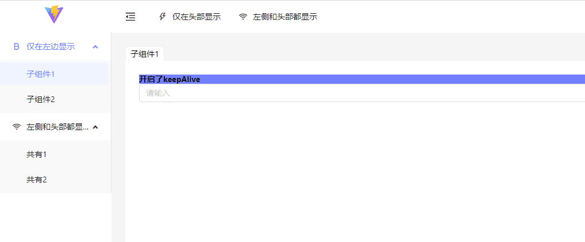

# react + vite 模板项目 [](https://github.com/thomas-void0/cta-template-admin/actions/workflows/docker.yml)

<!-- [在线预览](https://th-template.vercel.app/) -->

一个可以实现路由 keepAlive，具有类似浏览器访问页签功能的模板项目。

[阿里云在线预览](http://47.108.203.65) | [vercel online](https://th-template.vercel.app/)

<!--  -->



# 模板下载使用

可以通过 npx 命令安装此项目

```shell
npx create-template-app my-app --template admin
```

# 一、权限管理

## 路由权限

1. 在`src/config/access.ts`中,同 umi 使用方式一致，配置对应权限对象。

```ts
import { InitialStateType } from "@/core/context/global";

export default function accessFactory(
  initialState: InitialStateType
): Record<string, boolean> {
  // const { accessInfo } = initialState

  return {
    canNav1: false,
  };
}
```

2. 在`src/routes/index.tsx`中,配置对应的 access key。

```ts
...

path: 'brandManage',
name: '品牌管理',
access: 'canNav1', // 对应的key
icon: <BoldOutlined />,
layout: {
	topItemRender: false
},

...
```

## 组件权限

在`src/core/Access`中：

1. `Access`组件：用于判断返回的 key，是否包含在后端的权限列表中，进而是否渲染传入的`children`

```tsx
<Access access="enterprisePrivate-label-batchImport">
  <Button onClick={handleBatchImport}>批量导入</Button>
</Access>
```

2. `useAccess`hook：返回对应的 access key 是否包含在后端返回的权限列表中。

```ts
const noticeUpdateAuth = useAccess("notice-update");
```

# 二、keepAlive

**注意：**

1. **为了稳定起见 keepAlive 仅仅针对路由级别生效。**
2. **默认不会开启 keepAlive**
3. **keepAlive 最多缓存的组件数，默认为 10 个，超过最大数量后会直接删除第一个缓存的组件。**（可以在 core.ts 中配置 maxLength 来扩大缓存容积）

开启方法：

在路由配置中增加`keepAlive：true`选项。

```ts
{
	path: 'brandRule',
	name: '品牌规则',
	keepAlive: true, // 开启
	element: lazyLoad(lazy(() => import('@/pages/BrandManage/BrandRule')))
},
```

# 三、页签功能

默认开启页签功能，如果需要关闭此功能。在`core.ts`中配置`isTab: false`。

页签支持拖拽，刷新，关闭等操作。

# 四、环境变量使用

访问: `getEnv()`

在项目根目录下，配置了三种环境文件`.env.development`,`.env.test`,`.env.production`。分别对应本地、测试、生产三个环境。里面已经配置了相应的环境变量和`gateway地址`。

如需更多配置，直接增加对应的字段即可。为了更加友好的提示，增加对应字段后，在`src/typings/vite-env.d.ts`中加入新增字段的类型。

```ts
interface ImportMetaEnv {
  readonly VITE_NODE_ENV: "development" | "test" | "production";
  readonly VITE_PREFIX_URL: string;
}
```

# 五、接口请求

在`src/core/service`中封装了`request`和`requestLegacy`两个请求实例。分别针对`gateway`接口和之前走`nginx`代理的接口。

# 六、开发代理

在`vite.config.ts`中增加自定义代理即可。

```js
...

server: {
	host: '127.0.0.1',
	port: 3000,
	open: true,
	proxy: {
		'/api': {
			target: proxyTarget.api,
			changeOrigin: true
		},
		'/user': {
			target: proxyTarget.nr,
			changeOrigin: true
		}
	}
}
...
```
